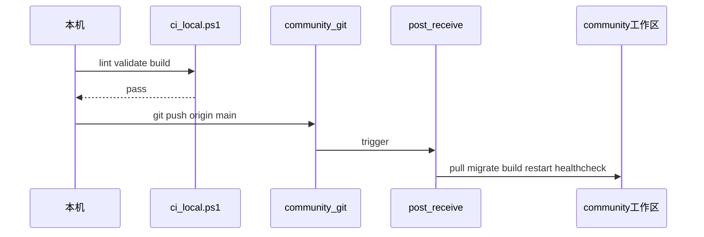

# CI/CD（现阶段 · 无正式发版）

> `origin` = `hxy@192.168.1.14:work/company/community.git`  
> 运行目录 = `~/work/company/community`

## 日常发布（推荐）

```powershell
cd d:\WorkSpace\Discord
.\scripts\push-origin.ps1
```

等价于：本机 `lint` + `prisma validate` + `build` → `git push origin main` → 服务器 **post-receive** 自动部署。

## 流程



## 本机 CI

[`scripts/ci-local.ps1`](../scripts/ci-local.ps1)：

1. `npm run lint`
2. `npx prisma validate`（不连数据库）
3. `npm run build`

不在本机跑 `prisma migrate`（依赖本地 Docker，与生产分离）。

## 服务器 CD

[`deploy/post-receive`](../deploy/post-receive) 在 push `main` 后执行：

1. `git pull origin main`
2. `npm ci`
3. `npx prisma migrate deploy`
4. `npm run build`
5. `bash deploy/install-services.sh`（重启 `community` + `community-proxy`）
6. 健康检查：生产端口 `127.0.0.1:3000` + 外放端口 `127.0.0.1:8080`

**部署日志**：`~/work/company/community/deploy.log`

## 双端口

| 端口 | 监听 | 用途 |
|------|------|------|
| **3000** | `127.0.0.1` | Next.js 生产进程（`community.service`），仅本机 / hook 探测 |
| **8080** | `0.0.0.0` | 外放访问（`community-proxy.service` → `deploy/port-proxy.mjs`） |

局域网访问：**http://192.168.1.14:3000**。数据库对 LAN 开放见 [`docs/LAN_ACCESS.md`](LAN_ACCESS.md)。

配置：[`deploy/ports.env`](../deploy/ports.env)。首次或改端口后：

```bash
ssh hxy@192.168.1.14
bash ~/work/company/community/deploy/install-services.sh
```

### 安装 / 更新 hook

```bash
ssh hxy@192.168.1.14
bash ~/work/company/community/deploy/install-hook.sh
```

## 目标分层

| 阶段 | 现在 | 以后（正式发版） |
|------|------|------------------|
| CI | 本机脚本 | PR 检查、多 Node 矩阵 |
| CD | push `main` → hook | staging、tag 回滚 |
| 发布 | 单环境生产 | `develop` → `main` |

## 暂不引入

GitHub Actions、Docker 镜像仓库、K8s、双环境、语义化 Release。

## 兜底（无 Git 时）

手工 tar/scp 见 [`community-server` Skill](../.cursor/skills/community-server/SKILL.md)「兜底部署」。

## 脚本索引

| 脚本 | 作用 |
|------|------|
| [`scripts/ci-local.ps1`](../scripts/ci-local.ps1) | 本机 CI |
| [`scripts/push-origin.ps1`](../scripts/push-origin.ps1) | CI + push |
| [`deploy/post-receive`](../deploy/post-receive) | 服务器 CD |
| [`deploy/install-hook.sh`](../deploy/install-hook.sh) | 安装 hook |
<<<<<<< HEAD
| [`deploy/install-services.sh`](../deploy/install-services.sh) | 双端口 systemd |
| [`deploy/port-proxy.mjs`](../deploy/port-proxy.mjs) | 外放 → 本机代理 |
=======
>>>>>>> 57170c6 (ci: add local CI scripts, post-receive CD hook, and CICD docs)
