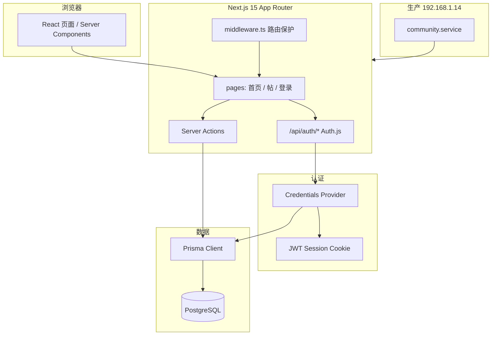

# 社区项目：技术选型与产品路线图

> 文档版本：与仓库 `main` 初始提交同步  
> 本地路径：`d:\WorkSpace\Discord`  
> 生产外放：http://192.168.1.14:8080；本机生产端口 `127.0.0.1:3000`（`~/work/company/community`）

---

## 1. 项目定位

自研全栈社区（非 Discourse / 非 headless 论坛）：单仓 Next.js 应用 + PostgreSQL，覆盖注册登录、发帖、评论、基础版主能力。面向局域网 / 小团队先用，后续可接域名与 HTTPS 对外运营。

---

## 2. 当前技术选型

### 2.1 总览

| 层级 | 选型 | 版本（约） | 选型理由 |
|------|------|------------|----------|
| 语言 | TypeScript | 5.8 | 与 Next / Prisma 生态一致，端到端类型 |
| 前端框架 | **Next.js**（App Router） | 15.5 | RSC、Server Actions、单仓前后端；社区 CRUD 适合服务端直连 DB |
| UI | **React** + **Tailwind CSS** | 19 / 4 | 暗色社区 UI，无重型组件库，迭代快 |
| 认证 | **Auth.js**（`next-auth` v5 beta） | 5.0 beta | Prisma Adapter 预留 OAuth；Credentials 邮箱密码 |
| 会话 | **JWT**（`session.strategy: "jwt"`） | — | Credentials 与 JWT 配套；改 role 需重新登录 |
| 密码 | **bcryptjs** | 3.x | 纯 JS，Windows 编译友好 |
| 校验 | **Zod** | 3.24 | 表单与 Server Action 入参 |
| ORM | **Prisma** | 6.6 | 迁移、类型安全 Client、PostgreSQL 一等支持 |
| 数据库 | **PostgreSQL** | 14（生产）/ 16（本地 Docker） | 关系型、后续全文检索 / 通知表扩展方便 |
| Markdown | **react-markdown** + **rehype-sanitize** | 10 / 6 | 发帖正文渲染且防 XSS |
| 本地 DB | **Docker Compose** | postgres:16-alpine | 一条命令起库，与生产逻辑一致 |
| 生产运行时 | **Node.js** + **systemd**（用户服务） | 22.x | 服务器已部署，无 Docker 跑应用 |
| 代码托管 | **Git**（仅本地仓库） | — | 作者 freeeeeG \<1284566797@qq.com\>，未推远端 |

### 2.2 架构示意（当前）



### 2.3 关键设计决策

| 决策 | 说明 |
|------|------|
| 单仓 monolith | 不做独立 BFF / 微服务；降低小团队维护成本 |
| Server Actions 写操作 | 注册、登录、发帖、评论、删帖；少写 REST 样板 |
| 不用 NextAuth 数据库会话 | Credentials 场景用 JWT；`Session` 表保留给未来 OAuth |
| slug 作帖子 URL | `/posts/[slug]`，发帖时从标题生成并去重 |
| 评论 `parentId` 自关联 | DB 支持多层；UI 暂限 2 层缩进 |
| 角色三档 | `USER` / `MOD` / `ADMIN`；CLI 提升管理员 |
| 本机与服务器代码分离 | 无远程软链；tar + SSH 部署（见 `community-server` Skill） |

### 2.4 目录与职责

```
src/
  app/              # 路由（(auth)、posts、admin、api/auth）
  actions/          # Server Actions（注册、登录、帖、评、管理）
  components/       # UI（Header、表单、PostCard、Markdown）
  lib/              # auth、db、posts、permissions、validations、slug
prisma/             # schema、migrations、seed、promote-admin
deploy/             # 服务器安装 / 构建 / systemd 脚本
scripts/            # smoke-test、db-inspect、setup.ps1
.cursor/skills/     # community-server、community-database
```

### 2.5 环境变量

| 变量 | 用途 |
|------|------|
| `DATABASE_URL` | Prisma 连接 PostgreSQL |
| `AUTH_SECRET` | Auth.js 签名（生产必须随机强密钥） |
| `AUTH_URL` | 站点根 URL（本地 `http://localhost:3000`，生产外放 `http://192.168.1.14:8080`） |

### 2.6 数据模型（已实现）

| 表 | 用途 |
|----|------|
| User | 用户；`passwordHash`、`role` |
| Account / Session / VerificationToken | Auth.js 标准表 |
| Category | 分类（种子：general / tech / life） |
| Post | 帖子；`slug`、`body`(Text)、`published` |
| Comment | 评论；`parentId` 回复 |

详见 [`community-database` Skill](../.cursor/skills/community-database/schema-reference.md)。

### 2.7 已实现功能（一至三期）

| 期 | 能力 |
|----|------|
| 一期 | 注册 / 登录、JWT 会话、Prisma 迁移、生产部署 |
| 二期 | 发帖（Markdown）、评论、分类、首页信息流 |
| 三期 | 删自己的帖/评；版主 `/admin` 删任意帖；`db:promote-admin` |

### 2.8 生产部署摘要

| 项 | 值 |
|----|-----|
| SSH | `hxy@192.168.1.14` |
| 路径 | `/home/hxy/work/company/community` |
| 进程 | `systemctl --user` → `community.service` → `npm start` :3000 |
| 数据库 | 本机 PostgreSQL，`community` / `community` |

---

## 3. 后续路线图（四期起）

### 3.1 推荐实施顺序


| 阶段 | 主题 | 目标 |
|------|------|------|
| **四期-A** | 治理 | 封禁、后台用户管理，补全三期管理能力 |
| **四期-B** | 体验 | 帖子编辑、列表分页 |
| **四期-C** | 互动 | 站内通知、未读角标 |
| **四期-D** | 发现 | 分类页、搜索 |
| **五期** | 基础设施 | HTTPS、备份、监控、部署自动化 |
| **六期** | 增强 | OAuth、邮件、图片、审计等 |

---

## 4. 四期需求明细（产品 + 技术落点）

### 4.1 治理（四期-A）— 建议优先

| 需求 | 用户价值 | 技术实现要点 | 库表变更 |
|------|----------|--------------|----------|
| 用户封禁 | 制止违规账号 | `authorize` / middleware 检查 `bannedAt`；封禁后 403 | `User.bannedAt DateTime?` |
| 后台用户列表 | 查人、封禁、改角色 | `/admin/users` 分页；Server Actions | 复用 `User.role` |
| 置顶 / 加精 | 运营精选内容 | 首页排序 `pinned DESC, createdAt DESC` | `Post.pinned`、`Post.featured` Boolean |
| 操作审计 | 追溯删帖/封禁 | 管理操作写日志 | `ModerationLog`（actorId, action, target, meta） |

**仍用**：Prisma migrate、Server Actions、现有 `permissions.ts` 扩展。

### 4.2 体验（四期-B）

| 需求 | 用户价值 | 技术实现要点 | 库表变更 |
|------|----------|--------------|----------|
| 帖子编辑 | 纠错、更新 | `/posts/[slug]/edit`；仅作者或 MOD；可选 30 分钟窗口 | 可选 `Post.editedAt` |
| 首页分页 | 帖多时不卡 | `take/skip` 或 cursor；`searchParams.page` | 索引已有 `createdAt` |
| 评论分页 | 长帖性能 | 按 `postId` 分页加载 | 索引已有 `(postId, createdAt)` |

**仍用**：Server Actions + `revalidatePath`；无需新中间件。

### 4.3 互动（四期-C）

| 需求 | 用户价值 | 技术实现要点 | 库表变更 |
|------|----------|--------------|----------|
| 站内通知 | 被回复知晓 | 评论创建时 `Notification.create` | 见下表 |
| 未读角标 | Header 提示 | RSC 读 `count unread`；标记已读 Action | `readAt` |
| 邮件通知（可选） | 站外提醒 | Nodemailer / Resend；用户偏好开关 | `User.notifyEmail` |

**建议 `Notification` 表**：

```
id, userId, type(enum: REPLY, POST_REMOVED, ...), 
title, body, linkUrl, readAt?, createdAt
```

**仍用**：PostgreSQL 存通知；暂不引入 Redis（量小）。

### 4.4 发现（四期-D）

| 需求 | 用户价值 | 技术实现要点 | 库表变更 |
|------|----------|--------------|----------|
| 分类页 `/c/[slug]` | 按版块浏览 | `getPostsByCategory(slug)` | 无 |
| 全文搜索 | 找历史帖 | **方案 A**：PG `tsvector` + GIN（无新服务） | `Post.searchVector` 或 generated column |
| | | **方案 B**：Meilisearch（帖量大时） | 同步任务 / webhook |
| 图片上传 | 富文本配图 | `public/uploads` 或 MinIO；Markdown 插 URL | `PostAttachment` 或 URL 字段 |

**搜索选型建议**：用户 &lt; 1 万帖用 **PostgreSQL 全文**；否则再拆 Meilisearch。

### 4.5 认证扩展（可并入四期-D 或六期）

| 需求 | 技术要点 |
|------|----------|
| GitHub OAuth | Auth.js `GitHub` provider；`Account` 表已有 |
| 找回密码 | `VerificationToken` + 邮件链接 + reset 页 |
| 邮箱验证 | 注册后发验证；`emailVerified` 字段已有 |

**注意**：OAuth 用户无 `passwordHash`；Credentials 与 OAuth 可并存。

---

## 5. 五期：基础设施

| 需求 | 说明 | 与当前选型关系 |
|------|------|----------------|
| Nginx 反代 | 80/443 → :3000 | 保留 systemd 跑 Node，Nginx 只做代理 |
| HTTPS | Let's Encrypt | `AUTH_URL` 改为 `https://域名` |
| 自动部署 | rsync / GitHub Actions SSH | 替代手工 `tar`；仓库目前仅本地 |
| `pg_dump` 定时备份 | cron 每日备份 | 继续 PostgreSQL，无换库 |
| `/api/health` | 返回 DB 连通 | 给监控 / Uptime 用 |
| Docker 化（可选） | compose：app + db | 与现 systemd **二选一**，不强制 |

---

## 6. 六期：增强（按需）

| 需求 | 优先级 | 技术方向 |
|------|--------|----------|
| 邮件通知全量 | 低 | SMTP 环境变量 + 队列（可选 BullMQ） |
| 点赞 / 收藏 | 中 | `PostLike`、`PostBookmark` 联合唯一索引 |
| @ 提及 | 低 | 解析评论正文写 Notification |
| 私信 | 低 | 新表 `Conversation` / `Message`，复杂度高 |
| 富文本编辑器 | 中 | TipTap / MDX 替代纯 textarea |
| 多语言 i18n | 低 | `next-intl` |
| 移动端 PWA | 低 | Next PWA 插件 |

---

## 7. 四期验收标准（建议）

- [ ] 管理员在后台封禁用户后，该用户无法登录且已有 JWT 失效（或下次请求拒绝）
- [ ] 首页在 20+ 帖子时分页正常，单页响应时间可接受（&lt; 500ms 量级）
- [ ] 用户被回复后收到站内通知，可标记已读，Header 未读数正确
- [ ] 分类页 `/c/general` 仅显示该分类帖子
- [ ] （若做搜索）关键词可命中标题与正文

五期额外：

- [ ] HTTPS 访问无混合内容警告，`AUTH_URL` 与 Cookie `secure` 正确
- [ ] 数据库每日备份可恢复

---

## 8. 明确不做（当前阶段）

| 项 | 原因 |
|----|------|
| Discourse 混合架构 | 已选全栈自研 |
| 微服务 / 独立 API 服务 | 规模不需要 |
| Redis / Kafka | 通知与会话量小，PostgreSQL 足够 |
| 推送到 Git 远端 | 按你要求仅本地仓库 |
| 远程目录软链开发 | Windows + SSHFS 不稳定，改用手动同步 |

---

## 9. 相关文档与 Skill

| 文档 / Skill | 内容 |
|--------------|------|
| [README.md](../README.md) | 快速开始、路由 |
| [NEXT_PHASE.md](./NEXT_PHASE.md) | 精简版期次 checklist |
| `community-server` | SSH、systemd、部署 |
| `community-database` | Schema、迁移、查数 |
| [prisma/schema.prisma](../prisma/schema.prisma) | 数据库真相源 |

---

## 10. 版本记录

| 日期 | 说明 |
|------|------|
| 2026-05-21 | 初版：一至三期已实现；四至六期规划与选型对齐 |
